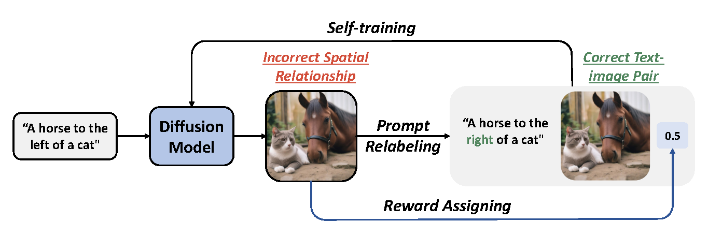
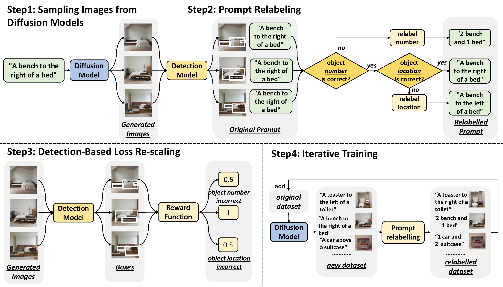

# Learning from Mistakes: Iterative Prompt Relabeling for Text-to-Image Diffusion Model Training

This is the official code implementation of the paper [Learning from Mistakes: Iterative Prompt Relabeling for Text-to-Image Diffusion Model Training](https://arxiv.org/abs/2312.16204).

## Brief introduction

<div align="center">
    
</div>

We propose Iterative Prompt Relabeling (IPR), a novel algorithm designed to enhance the alignment of images with text through
an iterative process of image sampling and prompt relabeling.

### Training Pipeline:

<div align="center">

</div>


**(1) Sampling Images from Diffusion Models:** sample images from a diffusion model conditioned on textual prompts. 

**(2) Prompt Relabeling:** detect the generated image to yield a bounding box; analyze the box to modify original prompts.

**(3) Detection-Based Loss Re-scaling:** apply a detection model to rescale the loss function. 

**(4) Iterative Training:** retrain the model with the updated dataset iteratively.

## Citation

If you use or extend our work, please cite the paper as follows:

```bib
@misc{chen2024learningmistakesiterativeprompt,
      title={Learning from Mistakes: Iterative Prompt Relabeling for Text-to-Image Diffusion Model Training}, 
      author={Xinyan Chen and Jiaxin Ge and Tianjun Zhang and Jiaming Liu and Shanghang Zhang},
      year={2024},
      eprint={2312.16204},
      archivePrefix={arXiv},
      primaryClass={cs.CV},
      url={https://arxiv.org/abs/2312.16204}, 
}
```